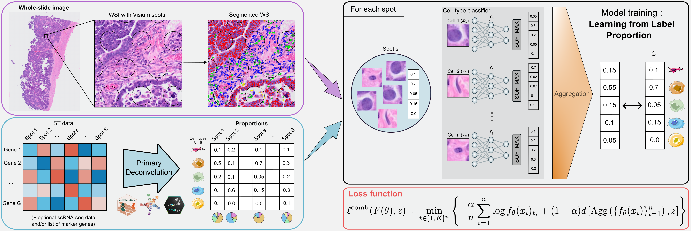
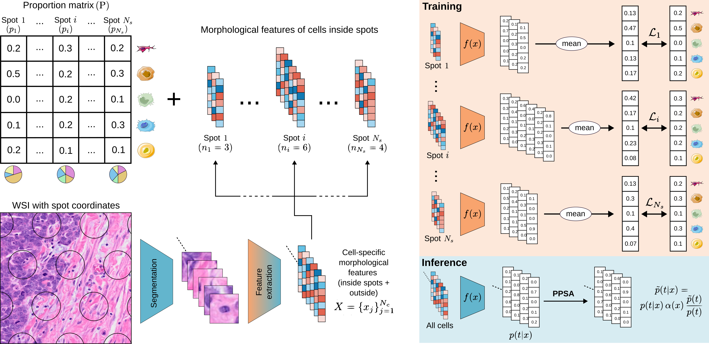

<h1 style="margin-top: -30px;">
    HEDeST: An Integrative Approach to Enhance Spatial Transcriptomic Deconvolution with Histology
</h1>

**HEDeST** is a deep-learning framework for assigning cell types to single cells on H&E slides using **deconvoluted spatial transcriptomics** data.



## Installation
To create your conda environment and install the requirements with ``pip``
```
conda create -y -n name-env python=3.9
conda activate name-env
pip install -r requirements.txt
```
To install pytorch, torch-scatter and tensorboard
```
pip install torch==1.13.1+cu116 torchvision==0.14.1+cu116 --extra-index-url https://download.pytorch.org/whl/cu116
wget https://data.pyg.org/whl/torch-1.13.0%2Bcu116/torch_scatter-2.1.1%2Bpt113cu116-cp39-cp39-linux_x86_64.whl
pip install torch_scatter-2.1.1+pt113cu116-cp39-cp39-linux_x86_64.whl
pip install tensorboard
```
To install openslide
```
conda install -c conda-forge openslide=3.4.1
```

## Code structure
The code is structured as follows :
```
hedest/        → Source code for HEDeST and analysis tools
benchmark/     → Benchmarking notebooks
case_study/    → Notebook for the case study (tutorial)
external/      → External tools (some modified for HEDeST)
simulations/   → Code for generating and analyzing simulated data

run_mask.sh
run_hovernet.sh
run_moco_ssl.sh
run_hedest.sh   → Shell scripts to run the full HEDeST workflow (in this order)
```

## Usage



### Pre-processing

To use HEDeST, you need:
- An H&E slide in .tif format
- A CSV file containing cell-type proportions per spatial transcriptomics spot

Then follow these preprocessing steps:
- use ``run_mask.sh`` to get a binary mask of your H&E slide
- use ``run_hovernet.sh`` to segment the slide and extract single-cell images in a dictionnary
- use ``run_moco_ssl.sh`` to train moco-v3 and infer the embeddings

### Training

Once you have the embeddings and the proportions, you can run HEDeST using ``run_hedest.sh``. To apply Prior Probability Shift Adjustment (highly recommended), also provide:
- the HoverNet segmentation .json file
- the AnnData object for your slide
- the slide name

## Tutorial

Download the dataset **'Human Breast Cancer: Ductal Carcinoma In Situ, Invasive Carcinoma (FFPE)'**:

```
wget https://cf.10xgenomics.com/samples/spatial-exp/1.3.0/Visium_FFPE_Human_Breast_Cancer/Visium_FFPE_Human_Breast_Cancer_image.tif
wget https://cf.10xgenomics.com/samples/spatial-exp/1.3.0/Visium_FFPE_Human_Breast_Cancer/Visium_FFPE_Human_Breast_Cancer_spatial.tar.gz
wget https://cf.10xgenomics.com/samples/spatial-exp/1.3.0/Visium_FFPE_Human_Breast_Cancer/Visium_FFPE_Human_Breast_Cancer_filtered_feature_bc_matrix.h5
```

Then, create a folder named ``Visium_FFPE_Human_Breast_Cancer``. Inside it, make sure you have a ST folder containing :
- a **spatial/** folder with low resolution images, scale factors and the list of tissue positions,
- the file ``filtered_feature_bc_matrix.h5``

You can find the proportion file in the **case_study** directory.

After running preprocessing and training, open the notebook ``case_study/DCIS_study.ipynb`` for analysis and visualization.

## Some classic errors
During segmentation, you can get the ``OSError: [Errno 39] Directory not empty: 'cache'`` error. Make sure to delete everything you have in this repository and apply chmod 777. \
Also, you can get the Openslide's error ``openslide.lowlevel.OpenSlideUnsupportedFormatError: Unsupported or missing image file``. In that case, we recommend to check the properties of your file with the command ``openslide-show-properties your_file.tif``. If your file is indeed incompatible with Openslide, then you can try :
```
vips tiffsave your_file.tif output-pyramidal.tif --tile --pyramid --bigtiff --compression jpeg --Q 90
```
