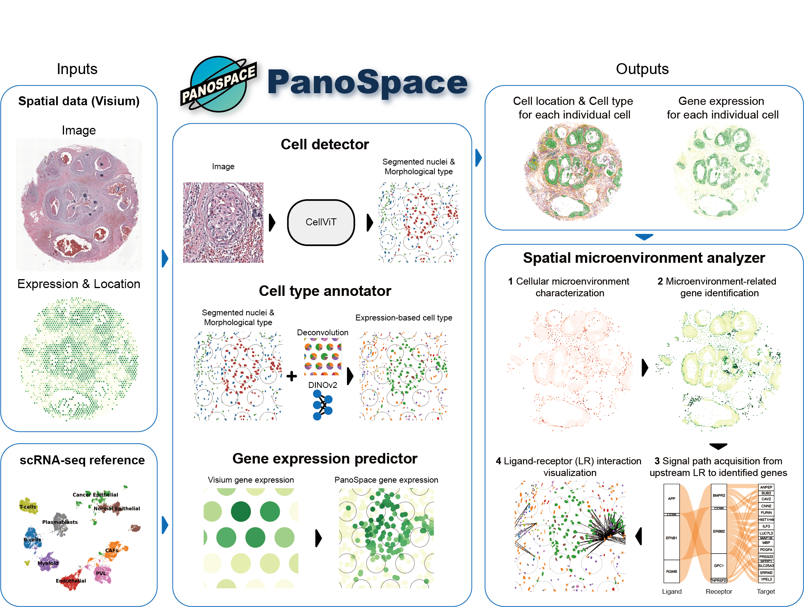

# PanoSpace

**High-resolution single-cell insight from low-resolution spatial transcriptomics**

<!-- PyPI  -->
[](https://pypi.org/project/panospace/)




PanoSpace bridges the gap between spot-based spatial transcriptomics (e.g., 10x
Visium) and single-cell resolution. It combines histology-guided cell detection,
transcriptomic deconvolution, deep-learning-based super-resolution and cell-type
annotation to generate consistent cell-level maps across entire tissue sections.

---

> ### ⚠️ This is the HEDeST fork of PanoSpace-core
>
> This copy of [PanoSpace-core](https://github.com/hehuifeng/PanoSpace-core) has
> been adapted to run as an **external benchmark method against HEDeST**, on the
> STHELAR data layout. The method itself is unchanged; what changed is the
> plumbing around it (inputs, outputs, solver, scalability).
>
> **Jump to:** [Benchmark usage](#-benchmark-usage-hedest-fork) ·
> [What was changed and why](#-what-was-changed-and-why) ·
> [File-by-file summary](#-file-by-file-summary-of-the-fork)

---

## 📦 Installation

### System Requirements

- **OS**: Linux (strongly recommended)
- **GPU**: NVIDIA GPU with CUDA support (strongly recommended for performance)
  - CUDA 12.1+ recommended
  - Minimum 8GB GPU memory

### Installation on the CBIO cluster (this fork)

```bash
bash external/PanoSpace/setup_env.sh          # creates the `panospace-env` conda env
conda activate panospace-env
python external/PanoSpace/run_panospace.py --help
```

`setup_env.sh` replaces the upstream interactive `install.sh`: it is
non-interactive, creates a Python 3.11 env, installs Torch from the CUDA 12.1
wheel index, and installs this checkout with `pip install -e . --no-deps`.
The `scvi-tools` stack (needed only by the `cell2location` backend) is installed
last and is allowed to fail — the rest of the pipeline works without it.

Check what landed with:

```bash
python external/PanoSpace/scripts/verify_install.py
```

The super-resolution stage needs the frozen **DINOv2-base** backbone. It is
fetched from the Hugging Face Hub on first use and then cached under
`<cache-dir>/dinov2-base`, so later runs work offline. If the compute nodes have
no outbound network, pre-fetch it once from a node that does:

```python
import os
from transformers import AutoModel
AutoModel.from_pretrained("facebook/dinov2-base").save_pretrained(
    os.path.expanduser("~/.panospace_cache/dinov2-base"))
```

CellViT weights (only needed when no `--seg-dict` is given) are downloaded from
Zenodo on first use into the CellViT backend cache.

<details>
<summary><b>Upstream installation options (PyPI / install.sh / conda yml)</b></summary>

**Option 1: Install from PyPI**

```bash
conda create -n panospace python=3.11
conda activate panospace
pip install panospace[all]
pip install --extra-index-url https://download.pytorch.org/whl/cu121 torch>=2.1 torchvision>=0.15
```

**Option 2: Install from source (automatic setup)**

```bash
git clone https://github.com/hehuifeng/PanoSpace-core.git
cd PanoSpace-core
bash install.sh
```

**Option 3: Manual installation from source**

```bash
conda env create -f environment-gpu.yml
conda activate PanoSpace
pip install --extra-index-url https://download.pytorch.org/whl/cu121 'torch>=2.1' 'torchvision>=0.15'
pip install .
```

</details>

<details>
<summary><b>Optimization solvers (Click to expand)</b></summary>

The final segment → cell-type assignment is equation (2) of the paper: a 0/1
problem with per-segment, per-spot and global quota constraints. `--solver auto`
reproduces the published method — the MILP — picking:

1. **Gurobi** (`gurobi`) — what the paper uses. Commercial, free for academia.
   A bare `pip install gurobipy` ships a size-limited licence far too small for
   a whole slide; you need a real one.
   <https://www.gurobi.com/academia/academic-program-and-licenses/>
2. **SCIP** (`scip`) — the open-source MILP fallback of the released code,
   installed by `setup_env.sh`. Correct, but the PanoSpace README itself warns
   of "hundreds of minutes"; a whole slide is 10⁶–10⁷ binary variables.

Additionally available, but **never chosen automatically**:

3. **OR-Tools min-cost flow** (`--solver flow`) — an exact reformulation of the
   same model, seconds instead of hours, no licence. See
   [Optional extras](#optional-extras--all-off-by-default).

</details>

---

## 🚀 Benchmark usage (HEDeST fork)

Everything goes through a single entry point, `run_panospace.py`, submitted with
`run_panospace.sh` at the root of the HEDeST repo.

### Inputs

| flag | file | notes |
|---|---|---|
| `--he` | `bench_data/{sample}/he.tiff` | full-resolution H&E, RGB |
| `--st` | `bench_data/{sample}/pseudovisium.h5ad` | needs `.X` counts + `.obsm['spatial']` (pixels, `(x, y)`) |
| `--seg-dict` | `bench_data/{sample}/hovernet.json` | *optional* — reuse an existing segmentation |
| `--proportions` | `bench_data/{sample}/sim/{level}/proportions.csv` | *optional* — reuse existing spot proportions |
| `--sc-ref` | `references/{organ}.h5ad` | *optional* — compute the proportions instead |
| `--output` | any directory | where results are written |

`--proportions` and `--sc-ref` are mutually exclusive: either the proportions are
given, or PanoSpace computes them.

### Outputs (written to `--output`)

| file | when | content |
|---|---|---|
| `panospace_predictions.csv` | always | `cell_id` × cell type, **exactly the shape of HEDeST's `pred_best_adjusted`** — so `df.idxmax(axis=1)` gives the predicted label. Cell ids are the ids of the segmentation dict. Rows are one-hot (PanoSpace assigns exactly one type per cell). |
| `proportions.csv` | only when PanoSpace ran the deconvolution | `spot_id` × cell type, rows summing to 1 — same layout as `sim/{level}/proportions.csv` |
| `segmentation.json` | only when PanoSpace ran the segmentation | HoVer-Net format (`{"mag", "mpp", "nuc": {id: {bbox, centroid, contour, type, type_prob, type_name}}}`) |
| `run_info.json` | always | parameters, per-stage timings, spot/cell counts, predicted label counts |
| `run.log` | always | full log of the run |

The gene-expression prediction, the microenvironment analysis and the
intermediate `sr_adata` are **not** produced — see
[What was changed and why](#-what-was-changed-and-why).

### 1. Benchmark run — reuse segmentation *and* proportions

This is the comparison that isolates PanoSpace's own contribution: it is handed
the same nuclei and the same spot-level proportions as HEDeST, and only its
cell-level assignment is being scored.

```bash
BENCH=/cluster/CBIO/data1/lgortana/STHELAR/bench_data
sbatch run_panospace.sh \
    --he           $BENCH/breast_s6/he.tiff \
    --st           $BENCH/breast_s6/pseudovisium.h5ad \
    --seg-dict     $BENCH/breast_s6/hovernet.json \
    --proportions  $BENCH/breast_s6/sim/level0/proportions.csv \
    --output       /cluster/CBIO/data1/lgortana/STHELAR/panospace/breast_s6/level0
```

### 2. Full pipeline — PanoSpace segments and deconvolves on its own

```bash
sbatch run_panospace.sh \
    --he  $BENCH/breast_s6/he.tiff \
    --st  $BENCH/breast_s6/pseudovisium.h5ad \
    --sc-ref /cluster/CBIO/data1/lgortana/STHELAR/references/breast.h5ad \
    --celltype-key cell_type \
    --sc-max-cells-per-type 2000 \
    --seg-model SAM \
    --output /cluster/CBIO/data1/lgortana/STHELAR/panospace/breast_s6/full
```

`--sc-max-cells-per-type` matters: the vendored RCTD densifies the whole
reference (`sc_adata.to_df()`), so a 175k-cell × 33k-gene atlas would need
~46 GB of RAM.

### 3. Deconvolution only, then many runs reusing it

```bash
# once: compute the proportions (no H&E needed, CPU is enough)
sbatch -p cbio-cpu --gres=none run_panospace.sh \
    --st $BENCH/breast_s6/pseudovisium.h5ad \
    --sc-ref .../references/breast.h5ad --celltype-key cell_type \
    --deconv-only --output .../panospace/breast_s6/deconv

# then: as many annotation runs as wanted, no deconvolution recomputed
for a in 0.0 0.3 0.6; do
  sbatch run_panospace.sh \
      --he $BENCH/breast_s6/he.tiff --st $BENCH/breast_s6/pseudovisium.h5ad \
      --seg-dict $BENCH/breast_s6/hovernet.json \
      --proportions .../panospace/breast_s6/deconv/proportions.csv \
      --alpha $a --output .../panospace/breast_s6/alpha_$a
done
```

### Scoring against the HEDeST ground truth

`panospace_predictions.csv` drops straight into the HEDeST scoring code:

```python
import pandas as pd
from sklearn.metrics import balanced_accuracy_score

pred = pd.read_csv("panospace_predictions.csv", index_col=0)   # cell_id x cell type
label = pred.idxmax(axis=1)                                    # same as HEDeST's adjusted.idxmax(axis=1)

gt = ...                                                       # {cell_id: true type}
common = [c for c in gt if c in label.index]                   # see the note below
print(balanced_accuracy_score([gt[c] for c in common], label.loc[common]))
```

**Note on the cell set.** PanoSpace drops nuclei that no sub-spot of the
super-resolution grid covers (`CellTypeAnnotator.filter_and_build_affiliations`);
those cells have no proportion prior at all, so upstream refuses to guess. The
predictions are therefore a *subset* of the segmentation, with identical ids —
intersect on the CSV index when scoring. `run_info.json` reports
`n_cells_in` / `n_cells_out`, and the run logs a warning with the percentage.
`--mask-mode all` reduces the loss on sections made of several tissue fragments.

### Key parameters

| flag | default | meaning |
|---|---|---|
| `--alpha` | `0.3` | weight of the PanNuke morphology prior against the super-resolved proportions. `--no-morphology` disables the branch entirely. |
| `--ot-mode` | `emd` | optimal-transport variant aligning cell types to morphology classes (`emd` exact, `sinkhorn` entropic) |
| `--spot-radius` | auto | spot radius in pixels (an integer, as upstream expects). Read from `uns['spatial'][...]['scalefactors']['spot_diameter_fullres']/2`, or from `uns['pseudovisium']`, or pass `--mpp` + `--spot-diameter-um`. Drives both membership radii and the sub-spot grid pitch. |
| `--sr-crop-radius` | = spot radius | half-size of the DINOv2 centre crop. The paper's `2r × 2r` with `r` = spot radius. Pass `129` for the released code's hard-coded constant. |
| `--neighb` | `3` | the context crop is `neighb`× wider than the centre crop → the paper's `6r × 6r` |
| `--solver` | `auto` | `auto` = the published MILP (Gurobi, else SCIP). `flow` is an exact, far faster reformulation — opt-in only |
| `--mask-mode` | `largest` | upstream: only the largest tissue contour. `spots` keeps every fragment carrying measured spots — needed on multi-piece sections, see below |
| `--mask-downscale` | `1` | upstream: full-resolution Canny. `auto` is 10× faster for a 0.06 % difference |
| `--cache-dir` | `~/.panospace_cache` | DINOv2 weights, sub-spot grid, super-resolution checkpoint and features. Outside the repo on purpose. |

---

## 🔧 What is adapted, and what is not

> **The method is untouched.** Every algorithm, every default parameter and the
> solver are the ones of the released PanoSpace-core. What changed is the
> plumbing around them: which files go in, which files come out. The purpose of
> this fork is to benchmark *the real PanoSpace* against HEDeST, so anything
> that would move the numbers is either reverted, or off by default behind a
> flag.

### Adapted: inputs and outputs

| # | change | why it cannot alter the method |
|---|---|---|
| 1 | **`--seg-dict`** — reuse an existing HoVer-Net segmentation instead of running CellViT | the nuclei and their PanNuke classes are an *input* to PanoSpace, not part of it. Without it, PanoSpace and HEDeST would be labelling different cells and the comparison would be meaningless. The PanNuke integer coding is identical between HoVer-Net and CellViT (`0 nolabel, 1 neoplastic, 2 inflammatory, 3 connective, 4 dead, 5 epithelial`), so nothing is translated |
| 2 | **`--proportions`** — reuse spot-level proportions instead of deconvolving | same: the spot-level proportion matrix is an *input* to the annotation stage |
| 3 | **`--deconv-only`** — stop after deconvolution | a new entry point; deconvolution itself is unchanged |
| 4 | **`--output`**, HEDeST-shaped prediction CSV, HoVer-Net-shaped segmentation JSON | writing only |
| 5 | **Gene-expression prediction and microenvironment analysis deleted** | both are *downstream* of the cell-type assignment and were out of scope. Removing them cannot change the assignment |
| 6 | The spot radius is read off the ST object instead of typed in by hand | upstream's quick-start has you write `deconv_adata.uns['radius'] = 100` yourself. This reads the same integer from `scalefactors['spot_diameter_fullres'] / 2`. `--spot-radius` overrides it |

### Deviations that could not be avoided

Three, all small, all documented:

1. **`make_sr_datalist` cannot run with a non-integer radius.** It uses the
   radius as a `range()` step, and `range()` refuses a float. Since upstream
   expects a hand-typed integer anyway, the resolved radius is rounded to an
   int — exactly the number a user would have typed.
2. **fp16 does not exist on CPU.** On a GPU the precision is upstream's
   `"16-mixed"`, unchanged. On CPU it falls back to `"32"`, where upstream
   would simply crash.
3. **A `NameError` in the DINOv2 loading path.** Upstream's "could not load
   DINOv2" message references a variable Python has already deleted, so the
   real cause is replaced by a `NameError`. Fixed so the message prints.

Everything else that differs from a stock checkout is invisible to the maths:
the H&E is decoded once instead of three times, CellViT's `type_prob` is carried
into the output JSON instead of being dropped, and DINOv2's weights are cached
locally after the first download.

### Optional extras — all OFF by default

None of these run unless you ask for them. They exist because the released code
does not scale to a whole slide; the benchmark uses the published path.

| flag | default | what it does |
|---|---|---|
| `--solver flow` | off (`auto` = the published MILP: Gurobi, else SCIP) | solves the *same* model as a min-cost flow. The constraint matrix of equation (2) is totally unimodular once each nucleus lies in at most one spot, so the flow optimum **is** the MILP optimum — verified against SCIP, objective difference exactly 0. Seconds instead of hours, no Gurobi licence. Use when the MILP is intractable |
| `--mask-downscale auto` | off (`1` = upstream full-resolution Canny) | detects the tissue outline on a ~16 MP proxy instead of 617 MP. 10× faster, 3× lighter, 0.06 % difference in the sub-spot grid |
| `--mask-mode spots` | off (`largest` = upstream) | keeps every tissue fragment that carries at least one **measured spot**. Upstream keeps only the single biggest contour, silently discarding the other pieces of a multi-fragment section. See [Multi-fragment sections](#multi-fragment-sections-when-to-use---mask-mode-spots) |
| `dedup_overlapping_spots=True` | off (upstream only warns) | if a nucleus falls inside two spot discs, keep the nearest spot so the per-spot constraints stay consistent. Upstream warns, then the solver declares the problem infeasible. Never triggers on Visium geometry (0 such nuclei on `breast_s6`) |

### Multi-fragment sections: when to use `--mask-mode spots`

PanoSpace decides where the tissue is by running Canny edge detection and
keeping **the single largest closed contour**
(`make_sr_datalist` takes `cnt_info[0][0]`). On a section cut into several
pieces, every piece but the biggest gets no sub-spot, so every nucleus on it is
dropped — even where measured Visium spots sit on that tissue.

Surveyed across `bench_data`, the default is fine almost everywhere:

| slide | tissue contours | measured spots covered by the grid |
|---|---|---|
| breast_s6, cervix_s0_0, cervix_s0_1, lung_s3, lymph_node_s0 | 1 each | ~100 % |
| ovary_s1 | 2 | ~100 % |
| prostate_s0 | 3 | ~95 % |
| **skin_s4** | **5** | **73.0 %** |

Only `skin_s4` is seriously affected: upstream's mask covers 15,057 sub-spots
against 30,325 for the whole tissue, and **449 of its 1,665 spots (27 %) are
measured data PanoSpace never uses**.

`--mask-mode spots` fixes it with the only criterion that distinguishes a second
tissue piece from a speck of dirt — *does a measured spot sit on it?* Measured
end to end on `skin_s4`, published MILP, everything else at PanoSpace's defaults:

| | `largest` (upstream) | **`spots --mask-min-spots 5`** |
|---|---|---|
| fragments kept | 1 | **2** |
| sub-spots | 14,912 | 19,787 |
| **nuclei annotated** | 79,772 (80.8 %) | **96,831 (98.1 %)** |
| Melanocyte | 46,982 | 46,961 |
| Immune | 23,794 | 29,924 |
| Structural | 8,996 | 16,616 |
| **Epithelial** | **0** | **3,330** |
| SCIP | 212 s, optimal, 1 node | 427 s, optimal, 1 node |

The Epithelial row is the point: with upstream's mask PanoSpace returns **zero
epithelial cells on a skin section**, because the epidermis sits entirely on a
discarded fragment. It is not losing a random sample of cells, it is losing a
whole compartment.

The criterion is also *tighter*, not merely bigger: an area-threshold variant
keeping every contour down to 1 % of the largest needed 30,325 sub-spots and
still covered fewer measured spots (96.9 % vs 98.0 %), because area cannot tell
tissue from debris. That variant was dropped; `spots` replaces it.

Two filters are needed, not one. Canny also outlines texture *inside* the
tissue, and those inner contours contain spots too — keeping them naively gave
1,142 contours and a patchwork mask. So contours are walked largest-first and
one is skipped when it already lies inside a fragment that was kept.

`--mask-min-spots` sets how many measured spots a fragment must carry. With the
default of 1, `skin_s4` keeps 20 fragments: the 2 real pieces (1,177 and 396
spots) plus 18 specks of debris that each catch exactly one spot centre — worth
29 sub-spots out of 19,816. Any threshold between 2 and 396 keeps exactly the
two real pieces; 5 is used below.

**Recommended policy:** leave the default (`largest`, upstream) for every slide,
and for `skin_s4` only:

```bash
sbatch run_panospace.sh ... --mask-mode spots --mask-min-spots 5
```

### Two places where the paper and the released code disagree

Found while checking the parameters; worth knowing about.

**`alpha` is inverted — but the value agrees.** The paper writes

> max_Y ⟨ α·V⁽¹⁾ + (1−α)·V⁽²⁾ , Y ⟩ , with **α = 0.7** as the default

where V⁽¹⁾ is the deconvolution/super-resolution term and V⁽²⁾ the morphology
term. The code writes the complement:

```python
scores = (1.0 - alpha) * sr_scores + alpha * morph_scores   # alpha = 0.3
```

So `alpha=0.3` in the code **is** `α=0.7` in the paper — 0.7 on deconvolution,
0.3 on morphology either way. The default here is the code's `0.3`, i.e. the
paper's `0.7`. Only the name is flipped.

**The DINOv2 patch size genuinely differs.** The paper says:

> a local patch centered on the spot (size 2r × 2r, where r is the spot radius)
> and a larger neighborhood patch (size 6r × 6r)

The released code hard-codes that radius to `129` px regardless of the slide.
On a slide whose spot radius is 100 px the two disagree, and the constant is not
scale-invariant — at a different `mpp` it crops a different physical area than
the Methods describe. **This fork follows the paper**: `--sr-crop-radius`
defaults to the slide's own spot radius, giving 2r × 2r and 6r × 6r exactly.
Pass `--sr-crop-radius 129` to reproduce the released constant.

The `neighb=3` default is untouched and matches the paper (3 × 2r = 6r).

## 🐍 Python API

```python
import os
import panospace as ps
from panospace import bench

OUTPUT_DIR = "results"

# ==============================================================================
# Step 1: cells -- reuse a segmentation, or detect them
# ==============================================================================
# (a) reuse an existing HoVer-Net segmentation (no model runs)
seg_adata, contours = ps.detect_cells(seg_dict="path/to/hovernet.json")

# (b) or detect them with CellViT and get the HoVer-Net-shaped dict back
# from PIL import Image
# seg_adata, contours, seg_dict = ps.detect_cells(
#     Image.open("path/to/visium_slide.tif"),
#     model="cellvit", model_name="SAM", return_seg_dict=True,
# )

# ==============================================================================
# Step 2: spot-level cell-type proportions
# ==============================================================================
visium_adata = bench.load_st_adata("path/to/pseudovisium.h5ad")

# (a) reuse proportions you already have
deconv_adata = bench.attach_proportions(
    visium_adata, bench.load_proportions("path/to/proportions.csv")
)

# (b) or run the deconvolution ensemble
# deconv_adata = ps.deconv_celltype(
#     adata_vis=visium_adata,
#     sc_adata=bench.load_sc_reference("ref.h5ad", celltype_key="cell_type"),
#     celltype_key="cell_type",
#     methods=['RCTD', 'spatialDWLS', 'cell2location'],
#     cache_dir=os.path.join(OUTPUT_DIR, 'deconv_cache'),
#     project_name='breast_s6',
#     resume=True,
# )

# Spot radius in pixels -- grid pitch and membership radii both derive from it.
deconv_adata.uns['radius'] = bench.infer_spot_radius(visium_adata)

# ==============================================================================
# Step 3: super-resolution (histology -> proportions on a dense sub-spot grid)
# ==============================================================================
sr_adata = ps.superres_celltype(
    deconv_adata=deconv_adata,
    img_dir="path/to/visium_slide.tif",
    radius=deconv_adata.uns['radius'],   # paper: local patch 2r x 2r, r = spot radius
    # mask_mode="all",           # opt-in: keep every tissue fragment
    # mask_downscale="auto",     # opt-in: detect the outline on a small proxy
)

# ==============================================================================
# Step 4: one cell type per segmented nucleus
# ==============================================================================
annotated_adata, annotator = ps.celltype_annotator(   # NB: returns a 2-tuple
    decov_adata=deconv_adata,
    sr_deconv_adata=sr_adata,
    seg_adata=seg_adata,
    alpha=0.3,                # = the paper's alpha = 0.7 (the code uses 1 - alpha)
    solver="auto",            # "auto" = the published MILP; "flow" to opt out
)

# ==============================================================================
# Step 5: HEDeST-shaped output
# ==============================================================================
pred_df = bench.predictions_to_frame(annotated_adata, deconv_adata.uns['celltype'])
bench.write_predictions(pred_df, os.path.join(OUTPUT_DIR, "panospace_predictions.csv"))
```

### Data Requirements

**Visium Spatial Transcriptomics Data** (`visium_adata`)
- **Format**: AnnData object
- **Required fields**:
  - `.X`: Gene expression matrix (counts values), shape `(n_spots, n_genes)`
  - `.obsm['spatial']`: spot pixel coordinates `(x, y)`, shape `(n_spots, 2)`
- **Recommended**: `.uns['spatial'][key]['scalefactors']['spot_diameter_fullres']`
  so the spot radius is auto-detected.

**Single-Cell Reference Data** (`sc_reference`)
- **Format**: AnnData object
- **Required fields**:
  - `.X`: Gene expression matrix (counts values), shape `(n_cells, n_genes)`
  - `.obs[celltype_key]`: cell type annotations (categorical or string)
- Gene identifiers must match the ST object (symbols vs Ensembl ids).

**Histology Image**
- **Supported formats**: TIFF, PNG, JPEG
- **Magnification**: 20x or 40x
- Must share the pixel space of `.obsm['spatial']` and of the segmentation.

**Segmentation** (`--seg-dict`, optional)
- HoVer-Net JSON: `{"mag", "mpp", "nuc": {cell_id: {"centroid": [x, y],
  "contour": [[x, y], ...], "type": int, ...}}}`.

---

## ✅ Validation

### The reference run — `lymph_node_s0`, the largest bench_data slide

632,100 HoVer-Net nuclei, 3,068 spots, `sim/level2` (5 cell types, the
"original" annotation), run the benchmark way: `--seg-dict` + `--proportions`,
every method parameter left at PanoSpace's own default.

| stage | |
|---|---|
| sub-spot grid | 36,405 points on a 100 px lattice (1,786 dropped by the tissue mask) |
| DINOv2 features | 2 × (36,405 + 3,068) crops, ~19 min on an A40 |
| nuclei entering the assignment | 621,932 of 632,100 — **1.61 %** lie outside the sub-spot grid and are dropped by upstream's own filter |
| assignment | 3,109,660 binary variables, 637,117 constraints |
| result | T_NK 253,876 · B_Plasma 137,112 · Myeloid 124,808 · Fibroblast/Myofibroblast 69,478 · Blood vessel 36,658 |

Outputs and figures: `STHELAR/panospace_test/` — see `RESULTS.md` there.
`lymph_node_s0/level2_milp/` is the published method; `level2_flow/` is the same
inputs through the flow solver, kept for the equivalence check below. A second
slide, `skin_s4/level0`, was run the same way.

### The MILP: it does finish, but the cost is brutal

Run with `--solver auto` (→ SCIP; no Gurobi licence available), watched with
`--scip-verbose`:

| | `lymph_node_s0` (632 k nuclei, 5 types) | `skin_s4` (99 k nuclei, 4 types) |
|---|---|---|
| binary variables | 3,109,660 | 319,088 |
| model build | 40.6 s | 4.6 s |
| presolve | 93.4 s → 3,037,227 binaries | 17.8 s → 206,664 binaries |
| **solve** | **38,046 s = 10 h 34 m** | **204 s = 3 m 24 s** |
| SCIP status | optimal, gap 0.00 % | optimal, gap 0.00 % |
| **branch-and-bound nodes** | **1** | **1** |
| peak memory | ~20 GB | ~3.3 GB |
| the same assignment via `--solver flow` | **4.3 s** | **0.13 s** |

`Solving Nodes : 1` on both slides is the point: SCIP solved each at the root
node and never branched, because the LP relaxation came out integral by itself.
That is total unimodularity, observed in the released solver rather than argued
on paper — and it is exactly why the min-cost-flow reformulation reaches the
same optimum.

Ten times the variables turns three minutes into ten and a half hours: a
general-purpose simplex on a 3 M-column LP, versus a specialised network
algorithm on the same problem.

### Solver equivalence

Both solvers were run on **both real slides**, and the two solutions scored on
one common score matrix:

| | `lymph_node_s0` | `skin_s4` |
|---|---|---|
| MILP objective | 94310.4726020433 | 24001.4327163877 |
| flow objective | 94310.4726020005 | 24001.4327163877 |
| relative difference | 4.5e-13 | 1.5e-16 |
| per-cell-type counts | **identical** | **identical** |
| nuclei labelled differently | 23,192 (3.7 %) | 815 (1.0 %) |
| sum of their score differences | 4.3e-08 | 1.0e-15 |

The nuclei that differ are **ties**: their individual score gaps (up to 0.35)
cancel to the numerical floor, so both assignments are optimal. The residual
4.3e-08 on the larger slide is the flow solver's integer cost quantisation
(costs are scaled to 1e7 of the score range), as documented in `_solve_flow`.

`python scripts/test_solver_equivalence.py` reproduces the same check on
synthetic slides, where the objectives agree to 0.0 exactly.

### Everything else

| check | result |
|---|---|
| second full slide, published MILP | `skin_s4`/level0: 79,772 of 98,678 nuclei labelled (19.16 % outside the sub-spot grid — that section has sparser spot coverage), optimal in 3 m 24 s |
| per-spot quota constraint | assigned composition vs the input proportions, Pearson **0.982–0.999** across the 5 cell types (`04_spot_quota_check.png`). Not exactly 1.0 because the per-spot counts are integerised |
| spot ↔ nucleus membership vs HEDeST | same rule as `map_cells_to_spots` (ball of `spot_diameter_fullres/2` around each spot centre). Jaccard **0.9888** on `breast_s6`; the residual is PanoSpace's integer radius (100) against HEDeST's exact 100.348 |
| CellViT branch + HoVer-Net round-trip | CellViT-256 on a 512 × 512 crop → 138 nuclei; the written JSON carries `bbox`/`centroid`/`contour`/`type`/`type_name`/`type_prob`, and re-reading it through `--seg-dict` rebuilds an identical `seg_adata` |
| deconvolution ensemble | RCTD + spatialDWLS + EnDecon on a synthetic mixture with known truth → per-type Pearson 0.88 / 0.91 / 0.97 |
| `--deconv-only` | writes a valid `proportions.csv` (`spot_id` index, rows summing to 1) |
| quota / morphology switches | all combinations of `--no-global-quota`, `--no-spot-quota`, `--no-morphology` run; global quotas are hit exactly when enabled and relax when not |
| super-resolution train → checkpoint → predict → cache | `python scripts/smoke_test_superres.py --cpu` passes |
| cache re-use | re-running a slide with a different `--alpha` skips feature extraction entirely — super-resolution drops from ~1,700 s to ~12 s |
| tissue mask, `auto` vs upstream | 57,668 vs 57,700 sub-spots on `breast_s6` (0.06 %), 6.7 s / 4.8 GB vs 69.6 s / 14.0 GB |

## 📁 File-by-file summary of the fork

**Created**

| file | role |
|---|---|
| `run_panospace.py` | single CLI entry point for the whole pipeline |
| `panospace/bench.py` | I/O adapters only: HoVer-Net ↔ `seg_adata`, `proportions.csv` ↔ `deconv_adata`, HEDeST-shaped prediction frame, spot-radius lookup, reference loading (no filtering unless asked) |
| `setup_env.sh` | non-interactive conda env installer (`panospace-env`) |
| `scripts/test_solver_equivalence.py` | checks the flow solver against the SCIP MILP |
| `../../run_panospace.sh` | Slurm submission script, at the root of the HEDeST repo |

**Modified**

| file | change |
|---|---|
| `README.md` | this document |
| `setup.py` | dropped the `prediction` / `microenv` extras, added `ortools` and `osqp` |
| `environment.yml`, `environment-gpu.yml` | same dependency changes |
| `panospace/__init__.py` | removed `genexp_predictor` and the microenv exports |
| `panospace/tl/__init__.py` | removed the `predictor` backend from the registry |
| `panospace/_core/__init__.py` | docstring |
| `panospace/tl/detect.py` | `seg_dict=`, `use_morphology=`, `return_seg_dict=`, stable string cell ids |
| `panospace/_core/detection/cellvit.py` | returns the raw per-cell dicts, records `type_prob` |
| `panospace/_core/detection/_cellvit_backend/postprocessing.py` | carries `type_prob` through `process_cell_instance` |
| `panospace/tl/annotate.py` | added the opt-in `solver=`, `dedup_overlapping_spots=`, `mask_mode=`, `mask_downscale=` (all defaulting to upstream behaviour); corrected return-value docs |
| `panospace/_core/annotation/annotator.py` | same plumbing |
| `panospace/_core/annotation/_annotator_backend/annotator_utils.py` | OR-Tools probe, `_choose_solver` (`auto` = Gurobi → SCIP, as upstream), the opt-in `_solve_flow`, the opt-in `_dedup_spot_membership` |
| `panospace/_core/annotation/superres.py` | `mask_mode` / `mask_downscale` plumbing |
| `panospace/_core/annotation/_superres_backend/superres_utils.py` | `load_rgb_image` / `release_image` cache (one decode instead of three), `_tissue_mask` with the opt-in downscale, contour guard, DINOv2 weights cached after download, fixed a `NameError` in the DINOv2 failure path, `gpu`/`cuda` device naming |
| `panospace/_core/annotation/RCTD.py` | `max_cores` still defaults to upstream's 22; `PANOSPACE_RCTD_CORES` can lower it to fit a Slurm allocation (worker count does not affect the result) |
| `scripts/verify_install.py` | checks OR-Tools, drops the removed extras |
| `scripts/smoke_test_superres.py` | discovers the cache dir instead of recomputing its key |

**Deleted**

| file | reason |
|---|---|
| `panospace/tl/predict.py` | gene-expression prediction is out of scope |
| `panospace/tl/microenv.py` | microenvironment analysis depends on predicted expression |
| `panospace/_core/prediction/` (3 files) | backend of the above |

---

## 📖 Citation

If you use PanoSpace in your research, please cite:

He, HF., Peng, P., Yang, ST. et al. Unlocking single-cell level and continuous whole-slide insights in spatial transcriptomics with PanoSpace. *Nat Comput Sci* (2026). https://doi.org/10.1038/s43588-025-00938-y


## 📧 Contact

- **Hui-Feng He** (<huifeng@mails.ccnu.edu.cn>)
- **Xiao-Fei Zhang** (<zhangxf@ccnu.edu.cn>)

## 📄 License

This project is licensed under the MIT License - see the LICENSE file for details.
